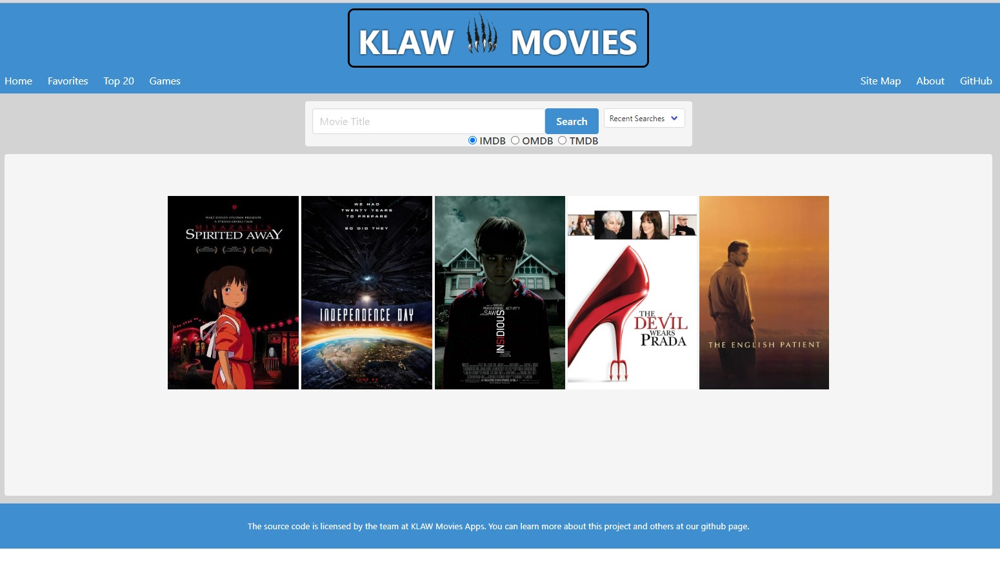
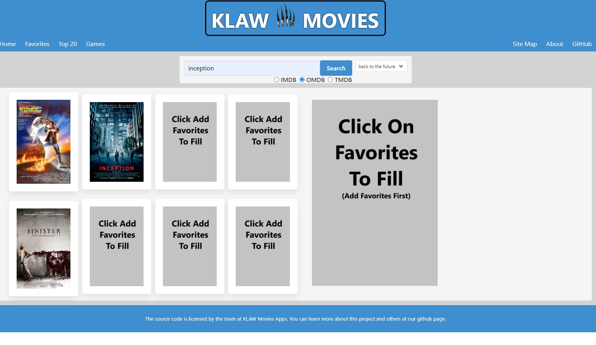
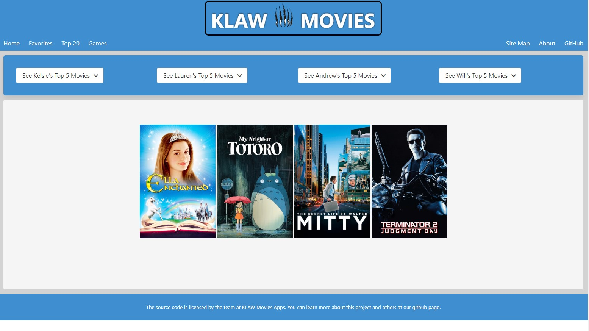
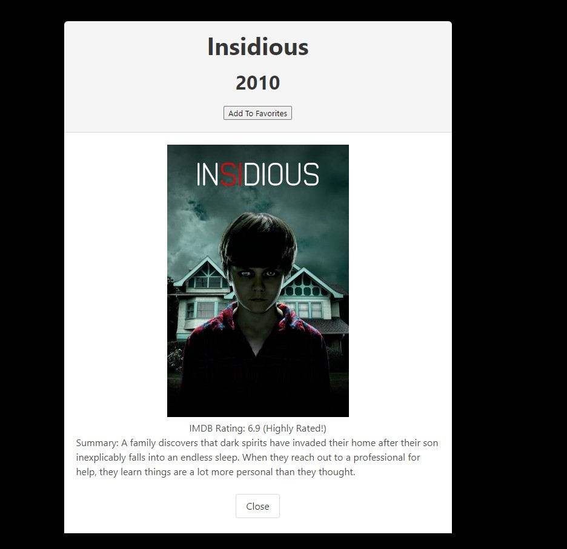
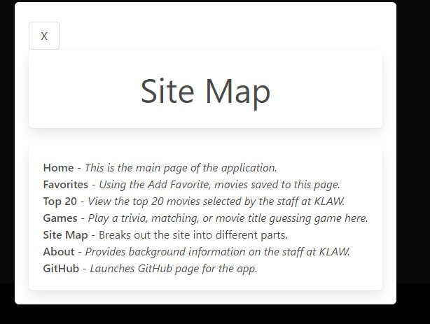
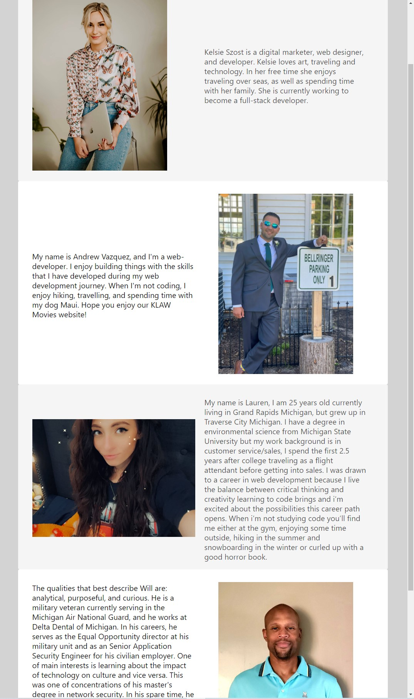

## Project 1: KLAW Movies 


## Description

* This application allows the user to search a movie title and get detials about the movie.
* The application uses data from TMDB, OMDB and IMDB so the user can choose which site  they would like to search from.
* Click the link below to see the deployed app 

https://laurencvengros.github.io/KLAW_Movies/

## User Story

```
AS a user
I WANT to search movie titles of multiple movies
SO THAT I can get information on the movie 
```

## Functionality

* IF you type a movie into the search bar and choose a source,
    THEN you will be presented with the title, release year, movie poster and summary of the movie.

* IF you would like the add the movie to your "personal favorites" list,
    THEN you may click the "add to favorites" button and view your saved titles in the "personalize" tab.

* IF you wouold like to learn more about us,
    THEN click on the "about" tab to reaed more.

* IF, you would like to see our recommendations for movies,
    THEN click the "top 20" tab to see our top choices.

* IF you would like to try some movie trivia,
    THEN click the "trivia" tab to choose a fun game to play.

* Search data comes from the following three APIs
    IMDB : https://developer.imdb.com/
    TMDB : https://www.themoviedb.org/?language=en-US
    OMDB : https://www.omdbapi.com/

# ScreenShots of the Website













# Collaborators 

* Kelsie Szost: https://github.com/kelsieszost

* Will Winston: https://github.com/win-will

* Andrew Vasquez: https://github.com/drewrvaz

* Lauren Cvengros: https://github.com/Laurencvengros
